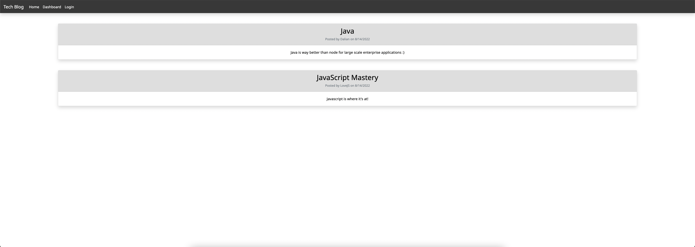
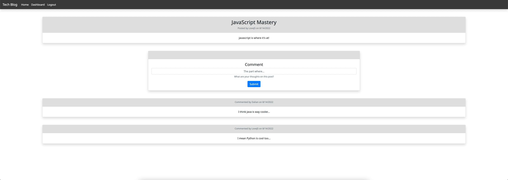
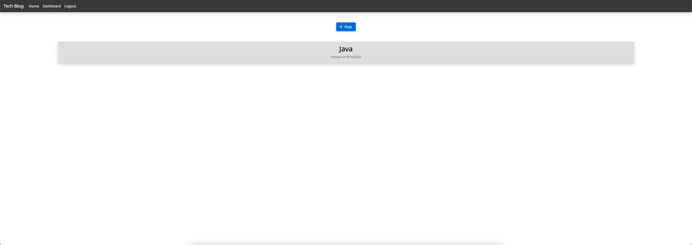
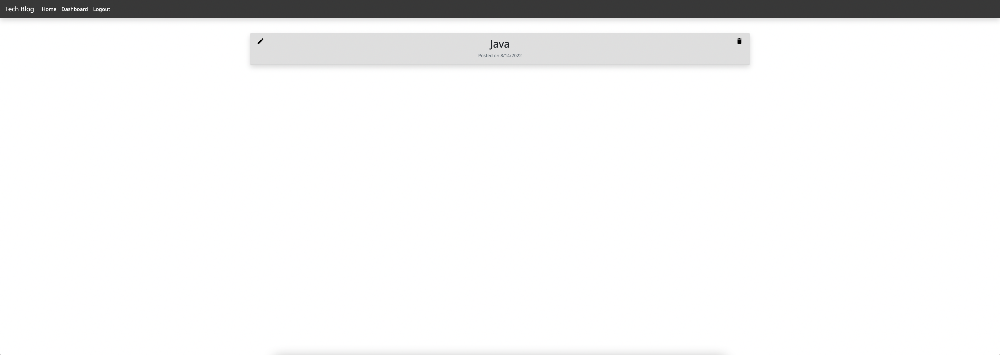

# Tech Blog


<br>

## Description

[Deployed Application](https://tech-blog-dg.herokuapp.com/)

Tech Blog is a full-stack web application that allows users to create an account, comment on other blog posts, and create blog posts. I built this application as a fun way to practice my full-stack web development skills and bring to life a passion of mine which is blogging!

In creating Tech Blog, I designed the database architecture, server-side logic, and front-end styling which resulted in a lot of really good practice in architecting a full-stack project. I learned a lot about using MySQL to establish a relational database, Node and Express for server-side logic and API development, and Handlebars and Bootstrap for rendering data driven pages with style.

<br>

## Table of Contents

- [Installation](#installation)
- [Usage](#usage)
- [Technology](#technology)
- [License](#license)

<br>

## Installation


3. Once unzipped, ensure that MySQL is installed and hosting a live server

4. Open the `connection.js` file in the `config` directory and edit line 7 with your MySQL server information to ensure a proper connection. You can also create a `.env` file and include:

```
  DB_NAME = 'database name'
  DB_USER = 'Your username'
  DB_PASSWORD = 'Your password'
```

5. Run the `schema.sql` file in either DBeaver or via the command-line to initiate the database.

6. Run the following commands to  install all dependencies, seed the database, and start the application

```
npm install

npm run seed

npm start
```

<br>

## Usage

Tech blog can be used to post and comment on other blog posts that all pertain to technology!

The homepage lists all currently posted blogs.



By clicking a blog post, you will be brought to the posts page which renders all comments made on the post. You can also leave your own comment.



You can also navigate to your dashboard, which will render all posts you've made and give you the option to create new posts.



Clicking on posts found in your dashboard will bring you to a page where you can update or delete any posts you've made.



<br>

## Technology
Listed below is all of the technology I used for this project:
- Node.js
- Express.js
- MySQL
- Sequelize (ORM)
- Handlebars.js
- Bcrypt and Express-session for authentication

<br>

## License

    Copyright © 2022 Dalian Grullon

    Permission to use, copy, modify, and/or distribute this software for any purpose with or without fee is hereby granted, provided that the above copyright notice and this permission notice appear in all copies.

    THE SOFTWARE IS PROVIDED "AS IS" AND THE AUTHOR DISCLAIMS ALL WARRANTIES WITH REGARD TO THIS SOFTWARE INCLUDING ALL IMPLIED WARRANTIES OF MERCHANTABILITY AND FITNESS. IN NO EVENT SHALL THE AUTHOR BE LIABLE FOR ANY SPECIAL, DIRECT, INDIRECT, OR CONSEQUENTIAL DAMAGES OR ANY DAMAGES WHATSOEVER RESULTING FROM LOSS OF USE, DATA OR PROFITS, WHETHER IN AN ACTION OF CONTRACT, NEGLIGENCE OR OTHER TORTIOUS ACTION, ARISING OUT OF OR IN CONNECTION WITH THE USE OR PERFORMANCE OF THIS SOFTWARE.